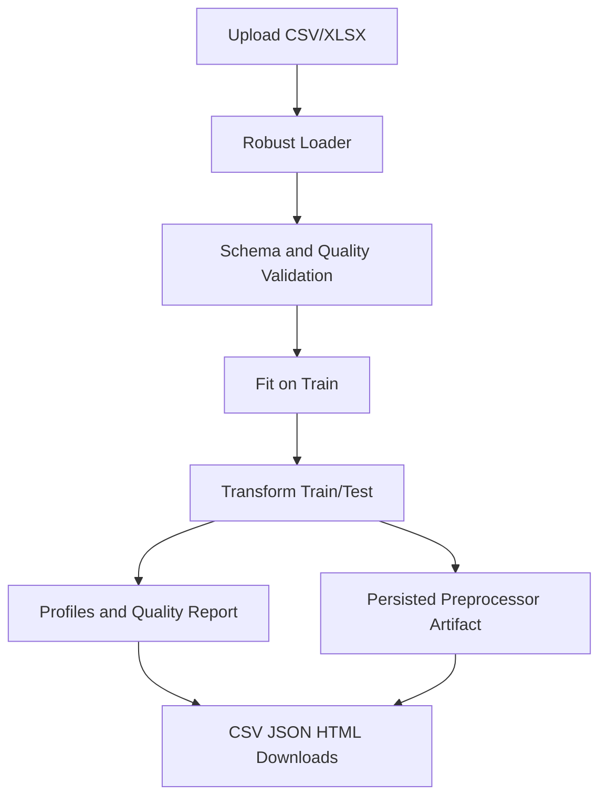

# Architecture Overview

This document explains the production-style preprocessing flow implemented in this project.

## System flow

## Core processing sequence

1. Input loading with encoding fallback (`utf-8`, `utf-8-sig`, `cp1252`, `cp1250`, `iso-8859-1`, `latin-1`).
2. Data quality checks:
   - duplicate column names
   - empty dataset / empty headers
   - all-null columns
   - constant columns
   - mixed object types
   - high-cardinality categoricals
3. Type coercion and feature role preparation.
4. Imputation:
   - numeric: `median` / `mean` / `k-NN`
   - categorical: `most_frequent` / `constant`
5. Outlier flagging with `IsolationForest` (`is_outlier`).
6. Numeric scaling (`StandardScaler` or `MinMaxScaler`).
7. Categorical encoding (`onehot` default, optional `ordinal`, advanced `binary_bits`).
8. Output rounding (optional), profiling, and artifact/report export.

## Fit/transform contract

`ModelReadyPreprocessor` supports:

- `fit(train_df)` — learns imputers/scalers/encoder/outlier model on train only.
- `transform(df)` — applies the learned transformations safely.
- `fit_transform(train_df)` — convenience path for single dataset demos.
- `save(path)` / `load(path)` — persist preprocessing for reproducible inference.

## Leakage prevention design

- Transforming validation/test data uses train-fitted components only.
- `target_column` and `id_column` can be excluded from transformations.
- UI supports split-aware workflow to demo correct ML practice.

## Artifacts

Expected outputs:

- `cleaned.csv`
- `pipeline_report.json`
- `profile_after.html`
- `preprocessor.joblib`

